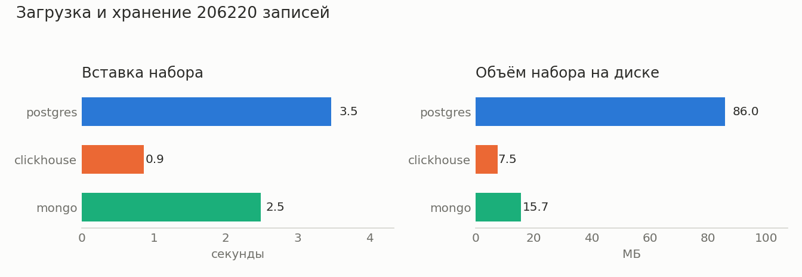
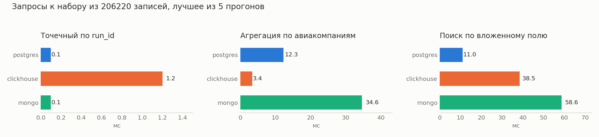

# ЛР1. Airflow и ETL-процесс

Тема: анализ воздушного движения по открытым ADS-B данным, регион — Кейптаун (ЮАР).

В работе развёрнут Airflow в Docker, подняты три хранилища, реализованы четыре ETL-процесса,
сырые данные загружены в слой ODS всех трёх хранилищ, проведено их сравнение.

## 1. Состав системы

```
OpenSky ─┐
adsb.lol ─┼─► DAG ods_positions ─┐
adsb.fi ─┘                       │
                                 ├─► Postgres   (ods_positions, ods_flights, ods_metar)
Табло ACSA ──► DAG ods_board ────┼─► ClickHouse (те же три таблицы)
                                 │
METAR ───────► DAG ods_weather ──┴─► MongoDB    (те же три коллекции)

data/raw ────► DAG ods_archive (разовая загрузка собранного вручную)
```

Развёртывание одной командой: `docker compose up -d`.

| Сервис | Образ | Порт | Назначение |
|---|---|---|---|
| airflow-apiserver | apache/airflow:3.3.2 | 8080 | веб-интерфейс, логин `airflow` / `airflow` |
| airflow-scheduler, airflow-dag-processor | apache/airflow:3.3.2 | — | планировщик и разбор DAGов |
| airflow-db | postgres:16 | — | служебная база Airflow |
| ods-postgres | postgres:16 | 5433 | ODS, реляционное хранилище |
| clickhouse | clickhouse/clickhouse-server:26.8 | 8123 | ODS, колонковое хранилище |
| mongo | mongo:8 | 27017 | ODS, документное хранилище |

Исполнитель — LocalExecutor. Celery, Redis и отдельные воркеры не разворачивались: для
четырёх DAGов на одной машине они только добавляют контейнеры.

## 2. Выбор хранилищ и аргументация

Данные проекта разные по характеру, поэтому взяты три разные модели хранения:

| Хранилище | Модель | Почему выбрано |
|---|---|---|
| PostgreSQL | реляционная | базовый вариант для ODS: строгая схема, индексы, при этом тип `jsonb` позволяет держать сырой ответ источника целиком и искать по вложенным полям |
| ClickHouse | колонковая | позиции бортов — это непрерывный поток однотипных записей с временной меткой, то есть ровно тот профиль, под который делалась колонковая СУБД: сжатие и агрегации по большим объёмам |
| MongoDB | документная | табло и METAR приходят вложенными документами с необязательными полями (гейт, лента багажа, порывы ветра), и схема источника может поменяться без предупреждения |

Четвёртый кандидат, объектное хранилище (S3/MinIO), не брался: сырые ответы уже лежат
файлами в `data/raw`, и отдельное объектное хранилище повторяло бы этот слой.

## 3. ETL-процессы

Реализовано четыре DAGа. Каждый состоит из задачи `extract` и трёх параллельных задач
`load` (динамический маппинг по хранилищам), поэтому один и тот же набор записей попадает
во все три базы и их можно сравнивать на одинаковых данных.

| DAG | Extract | Что грузит |
|---|---|---|
| `ods_positions` | опрос OpenSky, adsb.lol и adsb.fi по двум регионам | позиции бортов |
| `ods_board` | разбор табло аэропорта Кейптауна за сутки | рейсы с расписанием и фактом |
| `ods_weather` | METAR по четырём аэропортам ЮАР | сводки погоды |
| `ods_archive` | чтение `data/raw` | всё, что собрано вручную до появления Airflow |

Расписание в DAGах предусмотрено, но выключено: запуск ручной, пока в `docker-compose.yml`
не раскомментированы переменные `POSITIONS_SCHEDULE`, `BOARD_SCHEDULE`, `WEATHER_SCHEDULE`.

Слой ODS сырой: разобраны только поля, по которым идут запросы, а исходный ответ источника
лежит целиком в колонке `raw` (в Postgres `jsonb`, в ClickHouse строка, в MongoDB вложенный
документ). Повторная загрузка того же снимка пропускается по `run_id`, поэтому DAG можно
запускать сколько угодно раз.

### Загружено

| Набор | Записей | Снимков | Период |
|---|---|---|---|
| `ods_positions` | 3627 | 52 | 27.09–02.10.2026 |
| `ods_flights` | 3437 | 9 | 27.09–02.10.2026 |
| `ods_metar` | 398 | 7 | 27.09–02.10.2026 |

Числа совпадают во всех трёх хранилищах.

## 4. Сравнительный анализ хранилищ

### Методика

Замеры делает `tools/compare_storages.py` внутри контейнера Airflow. На реально собранных
3,5 тысячах записей разница между хранилищами тонет в накладных расходах на один запрос,
поэтому для замеров набор увеличен: собранные рейсы скопированы 60 раз, каждой копии выдан
свой `run_id`, итого **206 220 записей**. Копии пишутся в отдельную таблицу `bench_flights`,
слой ODS при этом не меняется.

Каждому хранилищу дана его обычная оптимизация по `run_id`: индекс в Postgres, ключ
сортировки в ClickHouse, индекс в MongoDB. Запросы повторяются 5 раз, берётся лучшее время.

Критерии: скорость вставки, объём на диске, три типовых запроса (точечный, агрегация,
поиск по вложенному полю сырого JSON) и удобство работы с сырыми данными.

### Результаты

| Показатель | PostgreSQL | ClickHouse | MongoDB |
|---|---|---|---|
| Вставка 206 220 записей, с | 3.5 | **0.9** | 2.5 |
| Объём набора на диске, МБ | 86.0 | **7.5** | 15.7 |
| Объём слоя ODS на диске, МБ | 4.9 | **0.8** | 1.8 |
| Точечный запрос по `run_id`, мс | **0.1** | 1.2 | **0.1** |
| Агрегация по авиакомпаниям, мс | 12.3 | **3.4** | 34.6 |
| Поиск по вложенному полю `raw`, мс | **11.0** | 38.5 | 58.6 |





### Как это читать

**ClickHouse** выигрывает там, где важен объём и агрегации: вставка в 4 раза быстрее
Postgres, данные на диске занимают в 11 раз меньше места (колонковое сжатие), групповой
запрос — самый быстрый. Проигрывает на точечном запросе: в MergeTree нет индекса в привычном
смысле, и даже при сортировке по `run_id` запрос обходится в миллисекунду против 0.1 мс
у конкурентов. Поиск по вложенному полю медленный: JSON разбирается на лету при каждом
чтении.

**PostgreSQL** ровный по всем критериям и лучший в работе с сырым JSON: `jsonb` хранится
разобранным, поэтому поиск по вложенному полю в 3,5 раза быстрее ClickHouse и в 5 раз
быстрее MongoDB. Расплата — объём: 86 МБ против 7.5 МБ, потому что `jsonb` хранит ключи
каждой записи и не сжимается так, как колонка.

**MongoDB** удобнее всех при загрузке (документ кладётся как есть, схему описывать не надо)
и быстра на точечном запросе, но проигрывает на агрегации и на поиске по вложенному полю.
При этом по объёму она вдвое экономнее Postgres.

### Вывод

Для этого проекта основным хранилищем слоя ODS выбирается **ClickHouse**.

Главный набор данных — позиции бортов: это непрерывный поток однотипных записей, который
растёт быстрее остальных и только дописывается, никогда не изменяясь. На таком профиле
решают объём и скорость агрегаций, а это две сильные стороны ClickHouse. При сборе каждые
15 минут за семестр накопится порядка 15–20 миллионов позиций, и разница в 11 раз по месту
на диске становится определяющей.

PostgreSQL остаётся в системе для табло и погоды: их объёмы невелики, зато нужны точечные
запросы и разбор сырого JSON, где он лучший. В ЛР2 на нём же будет построен слой
обработанных данных, где потребуются связи между рейсами, бортами и погодой.

MongoDB по итогам замеров не даёт преимуществ ни по одному критерию, кроме удобства
загрузки документов, поэтому в дальнейшей работе не используется.

### Что ограничивает выводы

Замеры сделаны на одной машине в Docker, с настройками хранилищ по умолчанию и без
конкурентной нагрузки. Набор получен копированием реальных данных, поэтому сжатие
в ClickHouse выглядит выгоднее, чем было бы на полностью разнородных записях.
Абсолютные числа зависят от машины, но соотношение между хранилищами устойчиво
и воспроизводится между прогонами.

## 5. Как воспроизвести

```bash
docker compose up -d                     # поднять Airflow и три хранилища
open http://localhost:8080               # веб-интерфейс, airflow / airflow
```

Запуск ETL из интерфейса или из командной строки:

```bash
docker compose exec airflow-scheduler airflow dags trigger ods_positions
docker compose exec airflow-scheduler airflow dags trigger ods_board
docker compose exec airflow-scheduler airflow dags trigger ods_weather
docker compose exec airflow-scheduler airflow dags trigger ods_archive
```

Проверка загруженного:

```bash
docker compose exec ods-postgres psql -U ods -d ods -c "select count(*) from ods_positions"
docker compose exec clickhouse clickhouse-client -u ods --password ods -d ods -q "select count() from ods_positions"
docker compose exec mongo mongosh -u ods -p ods --eval 'db.getSiblingDB("ods").ods_positions.countDocuments({})'
```

Замеры и графики:

```bash
docker compose exec airflow-scheduler python /opt/project/tools/compare_storages.py
python3 tools/compare_charts.py
```
